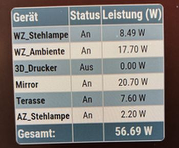

# MMM-ShellyStatusTable

The MMM-ShellyStatusTable module displays the switch status and power consumption of multiple Shelly devices in a table on the MagicMirror², including a total consumption sum. It regularly updates the data via the Shelly Cloud API Gen 1 and Gen 2+.

It is currently hard to say if every device is considered correctly. I have the following devices and it works:
 - Shelly Plug / PlugS
 - Shelly Plus Plug S
 - Shelly Plus 1 PM 

Example:



(my Mirror is running headless only, so only a stupid picture)


## Installation

### Install

In your terminal, go to your [MagicMirror²][mm] Module folder and clone MMM-ShellyStatusTable:

```bash
cd ~/MagicMirror/modules
git clone https://github.com/ChrisF1976/MMM-ShellystatusTable.git
```

not needed but doesn't hurt: 
```bash
npm install
```

### Update

```bash
cd ~/MagicMirror/modules/MMM-ShellyStatusTable
git pull
```

## Using the module

To use this module, add it to the modules array in the `config/config.js` file:

```js
	{
	module: "MMM-ShellyStatusTable",
	position: "bottom_center",
	disabled:false,
	config: {
		serverUri: "https://shelly-55-eu.shelly.cloud", // Shelly Cloud-API Server
		authKey: "XXXXXXXXXXXXXXXXXXXXXXXXXXXX", // API-key: settings > user settings > auth. cloud Key > get key
		shellys: [
			{ name: "device-name", id: "1xxxxxxc89" },
			{ name: "device-name", id: "2xxxxxxc89" },
			{ name: "device-name", id: "3xxxxxxc89" },
			{ name: "device-name", id: "4xxxxxxc89" },
			{ name: "device-name", id: "5xxxxxxc89" },
			{ name: "device-namee", id: "6xxxxxxc89" },
			// device-name: device > settings > device info > device id
			],
		updateInterval: 5*1000, // update every 5 seconds - 1s may be possible, but I did't try
		}
	},
```

## Configuration options

Option|Possible values|Default|Description
------|------|------|-----------
`serverUri`|`string`|none|To check your correct Server Uri see in your shelly app: "settings > user settings > auth. cloud Key > get key".
`authKey`|`string`|none|get your auth key in the app: "settings > user settings > auth. cloud Key > get key".
`shellys`|`array[]`|none|see config example. "device-name" can be "Batman" or "whatever". To find the device-id go to: "device > settings > device info > device id".
`updateInterval`|`integer`|5*1000|the api says that every second is possible. Find your best value.

## Tested with:
 - Shelly Plug / PlugS
 - Shelly Plus Plug S
 - Shelly Plus 1 PM 

## Credits
- Open AI
- my wife :-)

[mm]: https://github.com/MagicMirrorOrg/MagicMirror
