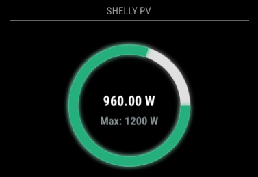
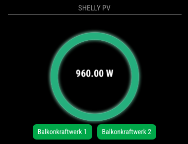

# MMM-ShellyPV

Example:


The MMM-ShellyPV module for MagicMirror is designed to monitor and display the status and energy consumption of Shelly devices, specifically focusing on devices related to solar power (PV systems) and energy usage. This module connects to the Shelly devices via their API to fetch real-time data such as power consumption, device status (on/off), and possibly other metrics depending on the configuration.

## Here’s a breakdown of its key features:

### 1. Device Status Monitoring:
	The module can fetch and display whether specific Shelly devices are on or off, allowing users to keep track of their devices' current status.

### 2. Power Consumption:
It monitors the power consumption of the Shelly devices, displaying the real-time energy usage in watts. This is useful for tracking energy production (e.g., solar power) and consumption (e.g., appliances, lights).

### 3. Gauge Display:
The module visualizes energy consumption data using a gauge (meter) that displays the total power being used or generated. This could be a dynamic gauge that fills based on the amount of power.

### 4. Device List:
The module can optionally display a list of Shelly devices, showing their names and their current status (on/off) based on the fetched data. This list is configurable, and users can choose whether it should be displayed or not.

### 5. Configuration Options:
The module is highly configurable, allowing users to set options like:
	Update Interval: How often the status of the devices should be updated.
	Max Power: The maximum power limit used for the gauge.
	Radius: The size of the gauge circle.
	ShowShellyList: A flag to decide whether the list of Shelly devices should be shown on the MagicMirror interface.

### 6. Dynamic Display:
The status of each Shelly device is dynamically updated based on the data fetched from the Shelly API, ensuring that the user always has current information.

### 7. Integration with MagicMirror:
As part of the MagicMirror ecosystem, the module provides an elegant, interactive way to monitor energy data from Shelly devices on the mirror interface, potentially alongside other smart home integrations or information.

## Installation

### Install

In your terminal, go to your [MagicMirror²][mm] Module folder and clone MMM-ShellyStatusTable:

```bash
cd ~/MagicMirror/modules
git clone https://github.com/ChrisF1976/MMM-ShellyPV.git
```

not needed but doesn't hurt: 
```bash
npm install
```

### Update

```bash
cd ~/MagicMirror/modules/MMM-ShellyPV
git pull
```

## Using the module

To use this module, add it to the modules array in the `config/config.js` file:

```js
	{
	module: "MMM-ShellyStatusTable",
	position: "bottom_center",
	disabled:false,
	header:"Meine Shellys",
	config: {
		serverUri: "https://shelly-55-eu.shelly.cloud", // Shelly Cloud-API Server
		authKey: "XXXXXXXXXXXXXXXXXXXXXXXXXXXX", // API-key: settings > user settings > auth. cloud Key > get key
		shellys: [
			{ name: "device-name", id: "1xxxxxxc89" },
			{ name: "device-name", id: "2xxxxxxc89" },
			{ name: "device-name", id: "3xxxxxxc89" },
			{ name: "device-name", id: "4xxxxxxc89" },
			{ name: "device-name", id: "5xxxxxxc89" },
			{ name: "device-namee", id: "6xxxxxxc89" },
			// device-name: device > settings > device info > device id
			],
		updateInterval: 5*1000, // update every 5 seconds - 1s may be possible, but I did't try
		MaxPower:"600",
                Radius:"100",
                ShowShellyList:true,
		}
	},
```

## Configuration options

Option|Possible values|Default|Description
------|------|------|-----------
`serverUri`|`string`|none|To check your correct Server Uri see in your shelly app: "settings > user settings > auth. cloud Key > get key".
`authKey`|`string`|none|get your auth key in the app: "settings > user settings > auth. cloud Key > get key".
`shellys`|`array[]`|none|see config example. "device-name" can be "Batman" or "whatever". To find the device-id go to: "device > settings > device info > device id".
`updateInterval`|`integer`|5*1000|the api says that every second is possible. Find your best value.
`MaxPower`|`integer`|0|Adjust this to your solar panel power to get the best view. If you put "//" in front or don't use this value is is not displayed. See pictures below. 
`Radius`|`integer`|100|defines more or less the size of the module. Down to 70 is possible. Use around 80-100 to get the best view.
`ShowShellyList`|`true/false`|true|to show the devices in the list set as "true". With this setting you can also see if the device is switched on or off.


### CSS
Included. Some descriptions are added. It took me a while to get a nice look. Adjust to your belongings.

## More Examples:

### With option "ShowShellyList:false,"


### "// maxPower:....,"


### With MMM-ShellStatusTable-module


(.https://github.com/ChrisF1976/ShellyStatusTable/)

## Tested with:
 - Shelly Plug / PlugS
 - Shelly Plus Plug S
 - Shelly Plus 1 PM 

## Credits
- Open AI
- my wife :-)

[mm]: https://github.com/MagicMirrorOrg/MagicMirror
